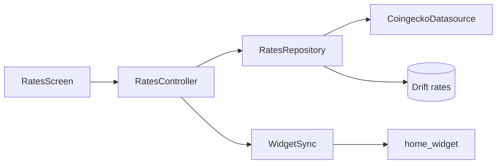

EN | [RU](docs/README_RU.md)

## coinglance 📈


**Offline-first CoinGecko client** for **Bitcoin** and **Toncoin** — mobile app, optional home widget, local SQLite cache. No custom backend; demo-friendly for portfolio and interviews.

[Releases](https://github.com/xvDoshik/coinglance/releases) ·
[Features](#-features) ·
[Install](#-install) ·
[Quick start](#-quick-start-dev) ·
[API](#-coingecko-api) ·
[Widget](#-home-screen-widget) ·
[Architecture](#-architecture) ·
[Structure](#-project-structure) ·
[Build](#-build-from-source) ·
[Tests](#-tests)

---

## 📖 Overview

One-line pitch: *offline-first CoinGecko client with a home widget and pull-to-refresh — cache on device, refresh when stale, no server of your own.*

CoinGlance tracks exactly two assets (`bitcoin`, `toncoin`) against **USD** or **EUR**, shows 24h change, and keeps the last good prices in **Drift** when the network or CoinGecko rate limit fails. A **Stale** badge appears when displayed data is older than five minutes or came only from cache after a failed refresh.

Native **Android-only** sibling (Kotlin, Compose, Room): [coinglance-android](https://github.com/xvDoshik/coinglance-android).

---

## ✨ Features

| | Feature | Details |
|---|---|---|
| 📊 | **Rates screen** | Large price typography, 24h %, relative “updated … ago” |
| 🔄 | **Refresh** | Pull-to-refresh; auto-refresh on open if cache &gt; 5 min |
| 💾 | **Offline** | Drift table `rates` — last successful fetch per coin + quote |
| 📱 | **Widget** | Android `AppWidget` + iOS WidgetKit template (`home_widget`) |
| ⚙️ | **Settings** | Quote currency **USD** / **EUR** (persisted) |
| 🌙 | **UI** | Material 3, dark theme by default |

---

## 📦 Install

### From GitHub Releases

1. Open [Releases](https://github.com/xvDoshik/coinglance/releases/latest).
2. Download **`coinglance-v1.0.0-android.apk`** (Android).
3. Install on device (enable “Install unknown apps” if needed).
4. Open the app once so rates load into cache and the widget can sync.

Web build (`coinglance-v1.0.0-web.zip`) is a static preview — run locally or host on any static file server.

iOS builds are not shipped from CI here (signing + Xcode required); use [Build from source](#-build-from-source) on a Mac with Xcode.

---

## 🚀 Quick start (dev)

### Requirements

| Tool | Version |
|------|---------|
| Flutter | 3.x stable |
| Dart | 3.13+ |
| Android SDK | For APK (optional) |
| Xcode | For iOS / macOS (optional) |

### Clone & run

```bash
git clone https://github.com/xvDoshik/coinglance.git
cd coinglance
flutter pub get
dart run build_runner build
flutter run
```

Codegen is required once after clone (`database.g.dart` for Drift).

---

## 🌐 CoinGecko API

Public endpoint (no API key in this demo):

```http
GET https://api.coingecko.com/api/v3/simple/price
  ?ids=bitcoin,toncoin
  &vs_currencies=usd|eur
  &include_24hr_change=true
```

| Topic | Note |
|-------|------|
| Rate limits | ~10–30 calls/min on free tier; app backs off to cache |
| Errors | `429` / network → show cached rows + **Stale** |
| Coins | Fixed preset: `bitcoin`, `toncoin` |

Response shape (USD example):

```json
{
  "bitcoin": { "usd": 65000.12, "usd_24h_change": 1.05 },
  "toncoin": { "usd": 5.42, "usd_24h_change": -0.31 }
}
```

Parsing lives in `lib/data/coingecko_datasource.dart` (`parseSimplePriceResponse`).

---

## 📱 Home screen widget

### Data flow

```text
RatesRepository → WidgetSync.pushRates()
  → HomeWidget.saveWidgetData('rates_json' | 'rates_lines')
  → Android CoinGlanceWidgetProvider / iOS WidgetKit reads App Group
```

| Key | Purpose |
|-----|---------|
| `group.com.coinglance.widget` | iOS App Group id |
| `rates_lines` | Human-readable multiline text for widget UI |
| `rates_json` | Structured payload for future rich layouts |

### Android

1. Install APK or `flutter run` on device.
2. Open app or pull to refresh.
3. Long-press launcher → **Widgets** → **CoinGlance**.

Receiver: `com.coinglance.coinglance.CoinGlanceWidgetProvider` (see `AndroidManifest.xml`).

### iOS

1. Open `ios/Runner.xcworkspace` in Xcode.
2. **File → New → Target → Widget Extension** → **CoinGlanceWidget**.
3. Replace generated Swift with `ios/CoinGlanceWidget/CoinGlanceWidget.swift`.
4. Enable App Group **`group.com.coinglance.widget`** on **Runner** and widget extension.
5. Build, run, add widget from gallery.

---

## 🏗️ Architecture



| Layer | Path | Role |
|-------|------|------|
| UI | `lib/features/rates/` | Riverpod, cards, pull-to-refresh |
| Settings | `lib/features/settings/` | USD/EUR `SegmentedButton` |
| Widget bridge | `lib/features/widget_bridge/` | Serialize cache for native widgets |
| Data | `lib/data/` | Dio client, Drift DAO, repository |
| Domain | `lib/domain/` | `CoinRate`, coin presets |

**State:** `flutter_riverpod` — `ratesControllerProvider`, `quoteCurrencyProvider`.

**Cache schema (Drift):** `rates(coin_id, quote, price, change_24h, fetched_at)` — composite primary key `(coin_id, quote)`.

---

## 📁 Project structure

```text
coinglance/
├── lib/
│   ├── main.dart
│   ├── app.dart
│   ├── core/dio_client.dart
│   ├── domain/coin_rate.dart
│   ├── data/
│   │   ├── database.dart
│   │   ├── coingecko_datasource.dart
│   │   └── rates_repository.dart
│   └── features/
│       ├── rates/
│       ├── settings/
│       └── widget_bridge/
├── android/…/CoinGlanceWidgetProvider.kt
├── ios/CoinGlanceWidget/CoinGlanceWidget.swift
├── test/
└── docs/README_RU.md
```

Platform folders (`android/`, `ios/`, …) are Flutter boilerplate; **application logic is Dart under `lib/`**.

---

## 🔧 Build from source

```bash
flutter pub get
dart run build_runner build

flutter run                      # debug device
flutter build apk --release      # Android APK
flutter build ios --release      # iOS (Xcode signing)
flutter build web --release      # static web/
flutter build macos --release    # macOS desktop
```

Output APK (Android):

```text
build/app/outputs/flutter-apk/app-release.apk
```

---

## 🧪 Tests

```bash
flutter analyze
flutter test
```

| Test file | Covers |
|-----------|--------|
| `test/coingecko_parser_test.dart` | JSON parsing USD/EUR |
| `test/coin_card_test.dart` | Rates card widget |
| `test/widget_test.dart` | App shell loads |

---

## ⚠️ Troubleshooting

| Issue | What to do |
|-------|------------|
| Empty prices after install | Pull to refresh; check network |
| CoinGecko 429 | Wait; cached prices still show with **Stale** |
| Widget empty | Open app once; confirm refresh wrote `rates_lines` |
| Drift build errors | Run `dart run build_runner build` |
| iOS widget not updating | Verify App Group on both targets |

---

## 📜 License

MIT — see [LICENSE](LICENSE).
