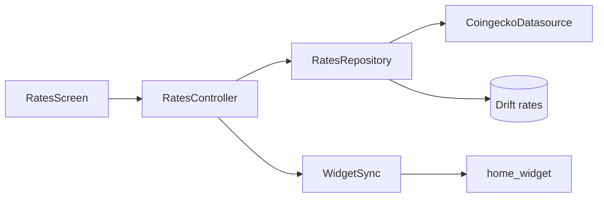

[EN](../README.md) | RU

## coinglance 📈


**Offline-first клиент CoinGecko** для **Bitcoin** и **Toncoin** — приложение, home widget, локальный кеш SQLite. Без своего бэкенда; удобно для портфолио и собесов.

[Releases](https://github.com/xvDoshik/coinglance/releases) ·
[Возможности](#-возможности) ·
[Установка](#-установка) ·
[Быстрый старт](#-быстрый-старт-разработка) ·
[API](#-coingecko-api) ·
[Виджет](#-виджет-на-домашнем-экране) ·
[Архитектура](#-архитектура) ·
[Структура](#-структура-проекта) ·
[Сборка](#-сборка) ·
[Тесты](#-тесты)

---

## 📖 Обзор

Фраза для собеса: *offline-first клиент CoinGecko с home widget и pull-to-refresh — кеш на устройстве, обновление когда протух, без своего сервера.*

CoinGlance следит ровно за двумя монетами (`bitcoin`, `toncoin`) в **USD** или **EUR**, показывает изменение за 24ч и хранит последние успешные цены в **Drift**, если сеть или лимит CoinGecko подвели. Бейдж **Stale** — когда данные старше пяти минут или остались только из кеша после неудачного refresh.

Нативный **только Android** вариант (Kotlin, Compose, Room): [coinglance-android](https://github.com/xvDoshik/coinglance-android).

---

## ✨ Возможности

| | Фича | Детали |
|---|---|---|
| 📊 | **Экран курсов** | Крупные цифры, % за 24ч, «обновлено … назад» |
| 🔄 | **Обновление** | Pull-to-refresh; авто при открытии если кеш &gt; 5 мин |
| 💾 | **Офлайн** | Таблица Drift `rates` — последний успешный fetch |
| 📱 | **Виджет** | Android AppWidget + шаблон iOS WidgetKit |
| ⚙️ | **Настройки** | Котировка **USD** / **EUR** (сохраняется) |
| 🌙 | **UI** | Material 3, тёмная тема по умолчанию |

---

## 📦 Установка

### Из GitHub Releases

1. Открой [Releases](https://github.com/xvDoshik/coinglance/releases/latest).
2. Скачай **`coinglance-v1.0.0-android.apk`** (Android).
3. Установи на телефон (при необходимости разреши установку из неизвестных источников).
4. Запусти приложение один раз — курсы попадут в кеш и синхронизируются с виджетом.

Архив **`coinglance-v1.0.0-web.zip`** — статическая web-сборка для локального просмотра или хостинга.

Сборку под iOS из релиза не выкладываем (нужны Xcode и подпись); собирай [из исходников](#-сборка) на Mac.

---

## 🚀 Быстрый старт (разработка)

### Требования

| Инструмент | Версия |
|------------|--------|
| Flutter | 3.x stable |
| Dart | 3.13+ |
| Android SDK | Для APK (опционально) |
| Xcode | Для iOS / macOS (опционально) |

### Клон и запуск

```bash
git clone https://github.com/xvDoshik/coinglance.git
cd coinglance
flutter pub get
dart run build_runner build
flutter run
```

После клона один раз нужен codegen (`database.g.dart` для Drift).

---

## 🌐 CoinGecko API

Публичный endpoint (без API key в демо):

```http
GET https://api.coingecko.com/api/v3/simple/price
  ?ids=bitcoin,toncoin
  &vs_currencies=usd|eur
  &include_24hr_change=true
```

| Тема | Заметка |
|------|---------|
| Лимиты | ~10–30 запросов/мин на free tier; приложение уходит в кеш |
| Ошибки | `429` / сеть → кеш + **Stale** |
| Монеты | Фиксированный пресет: `bitcoin`, `toncoin` |

Пример ответа (USD):

```json
{
  "bitcoin": { "usd": 65000.12, "usd_24h_change": 1.05 },
  "toncoin": { "usd": 5.42, "usd_24h_change": -0.31 }
}
```

Парсинг: `lib/data/coingecko_datasource.dart` (`parseSimplePriceResponse`).

---

## 📱 Виджет на домашнем экране

### Поток данных

```text
RatesRepository → WidgetSync.pushRates()
  → HomeWidget.saveWidgetData('rates_json' | 'rates_lines')
  → Android CoinGlanceWidgetProvider / iOS WidgetKit (App Group)
```

| Ключ | Назначение |
|------|------------|
| `group.com.coinglance.widget` | App Group на iOS |
| `rates_lines` | Текст для компактного виджета |
| `rates_json` | JSON для расширенных layout'ов |

### Android

1. Установи APK или `flutter run`.
2. Открой приложение или сделай pull-to-refresh.
3. Долгое нажатие на лauncher → **Виджеты** → **CoinGlance**.

Receiver: `com.coinglance.coinglance.CoinGlanceWidgetProvider`.

### iOS

1. `ios/Runner.xcworkspace` в Xcode.
2. **File → New → Target → Widget Extension** → **CoinGlanceWidget**.
3. Код из `ios/CoinGlanceWidget/CoinGlanceWidget.swift`.
4. App Group **`group.com.coinglance.widget`** на Runner и extension.
5. Собери, добавь виджет с экрана.

---

## 🏗️ Архитектура



| Слой | Путь | Роль |
|------|------|------|
| UI | `lib/features/rates/` | Riverpod, карточки, refresh |
| Настройки | `lib/features/settings/` | USD/EUR |
| Виджет | `lib/features/widget_bridge/` | Сериализация для native |
| Data | `lib/data/` | Dio, Drift, repository |
| Domain | `lib/domain/` | `CoinRate`, пресеты монет |

**Состояние:** `flutter_riverpod` — `ratesControllerProvider`, `quoteCurrencyProvider`.

**Кеш (Drift):** `rates(coin_id, quote, price, change_24h, fetched_at)`, PK `(coin_id, quote)`.

---

## 📁 Структура проекта

```text
coinglance/
├── lib/
│   ├── main.dart
│   ├── app.dart
│   ├── core/dio_client.dart
│   ├── domain/coin_rate.dart
│   ├── data/
│   └── features/
├── android/…/CoinGlanceWidgetProvider.kt
├── ios/CoinGlanceWidget/
├── test/
└── docs/README_RU.md
```

Логика приложения — **Dart в `lib/`**; каталоги платформ — обвязка Flutter.

---

## 🔧 Сборка

```bash
flutter pub get
dart run build_runner build

flutter run
flutter build apk --release
flutter build ios --release
flutter build web --release
flutter build macos --release
```

APK:

```text
build/app/outputs/flutter-apk/app-release.apk
```

---

## 🧪 Тесты

```bash
flutter analyze
flutter test
```

| Файл | Что проверяет |
|------|----------------|
| `test/coingecko_parser_test.dart` | JSON USD/EUR |
| `test/coin_card_test.dart` | Карточка курса |
| `test/widget_test.dart` | Загрузка shell |

---

## ⚠️ Troubleshooting

| Проблема | Решение |
|----------|---------|
| Пустые цены | Pull-to-refresh, проверь сеть |
| CoinGecko 429 | Подожди; кеш + **Stale** |
| Виджет пустой | Открой приложение, refresh |
| Ошибки Drift | `dart run build_runner build` |
| iOS виджет | App Group на обоих targets |

---

## 📜 Лицензия

MIT — см. [LICENSE](../LICENSE).
